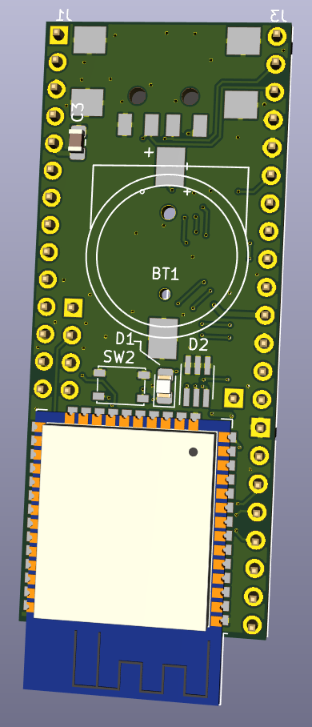
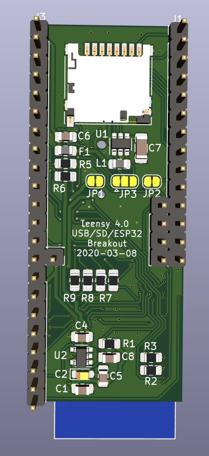
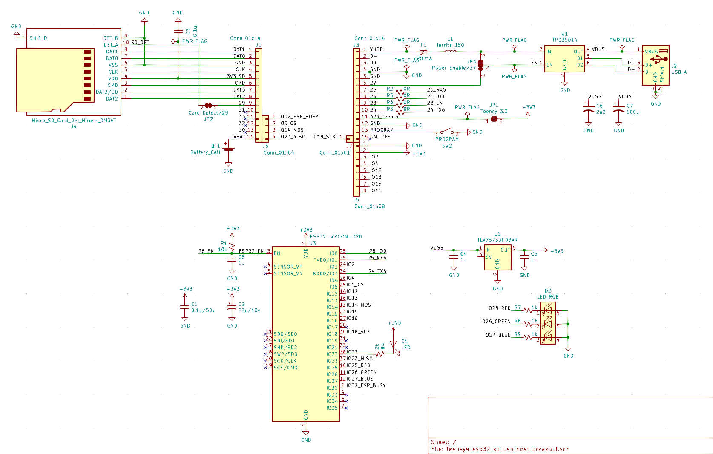

# Teensy 4.0 ESP32 / USB Host / MicroSD Breakout Board

A jumbo breakout board with ESP32, USB-A host and microSD connectors to mate with the [Teensy 4 Header Breakout Board](https://github.com/blackketter/teensy4_header_breakout).

Additionally, the board includes a space for RTC Battery Holder and provides another Teensy reset/programming button (since it covers up the one on the Teensy).

It's designed to mount above or below the Teensy 4 and Header Breakout board on a relatively tall header.

Designed in KiCad.

### Notes:

- Status: Initial in progress.
- [OSHPark order]() (Coming soon)
- Download bom/ibom.html and view it with web browser to see bill of materials and placement information.

### Options

* Three jumpers on the back:
  * JP1 - Short to use Teensy 3.3v to power ESP32 (instead of onboard 3.3v regulator)
  * JP3 - Cut left side, bridge right side to disable D27 as USB Power Enable
  * JP2 - Cut to disable D29 as SD card detect

### Connectors
* J1 and J3 connect to the [Teensy 4 Header Breakout Board](https://github.com/blackketter/teensy4_header_breakout) pins via a header
* J5 is optional and provides access to the onboard 3.3v regulator
* J6 & J7 are optional and provide connection to the corresponding pins directly below on Teensy.  These connect the ESP32 SPI to the Teensy SPI port for high-speed goodness.  Should be compatible with the Adafruit Airlift firmware.
* J2 is a USB-A host connector
* J4 is a MicroSD push-pull connector

### Additional features
* Teensy programming button
* Socket for 12mm lithium backup batter for RTC
* RGB and White LEDs connected to ESP32 for additional status

J1 - Left Side Pinout:

1. Teensy D34/SD DAT1
2. Teensy D35/SD DAT0
3. GND
4. Teensy D36/SD CLK
5. Teensy 3.3v
6. Teensy D37/SD CMD
7. Teensy D38/SD DAT3
8. Teensy D39/SD DAT2
9. Teensy D29/Card Detect
10. Teensy D31 (unused)
11. Teensy D33 (unused)
12. Teensy D32 (unused)
13. Teensy D30 (unused)
14. Teensy VBAT (battery backup)

J3 - Right Side Pinout:

1. Teensy VUSB
2. Teensy USB Host D-
3. Teensy USB Host D+
4. GND
5. GND
6. Teensy D27/USB Power EN
7. Teensy D25/ESP32 IO1 (Serial RX)
8. Teensy D26 / ESP32 IO0 (Boot Mode)
9. Teensy D28 / ESP32 EN (Reset)
10. Teensy D24 / ESP IO3 (Serial TX)
11. Teensy 3.3v
12. GND
13. Teensy Program
14. Teensy On/Off (unused)

J5 - Optional additional pins

15. GND
16. 3.3v from regulator on breakout board
17. ESP32 IO2
18. ESP32 IO4
19. ESP32 IO12
20. ESP32 IO13
21. ESP32 IO15
22. ESP32 IO16

J6 - SPI between ESP32 and Teensy

1. Teensy D9 / ESP32 IO32 (Busy)
2. Teensy D10 / ESP32 IO5 (CS)
3. Teensy D11 / ESP32 IO14 (MOSI)
4. Teensy D12 / ESP32 IO23 (MISO)

J7 - SPI between ESP32 and Teensy (cont.)

1. Teensy D13 / ESP32 IO18 (SCK)
